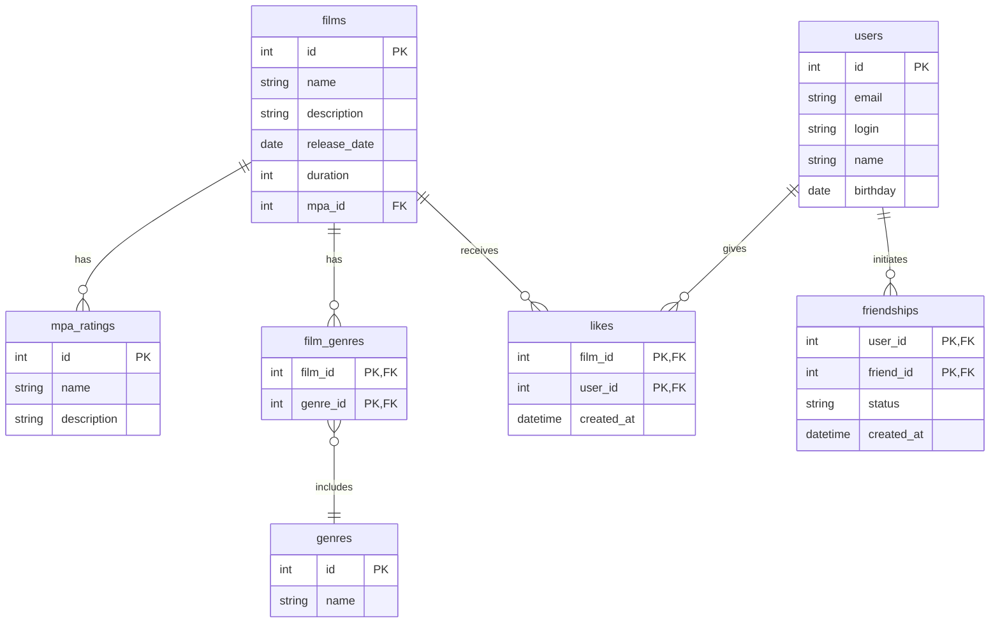

# java-filmorate

## БД

Для хранения данных реализована реляционная база данных. Ниже представлена ER-диаграмма структуры БД выполненная в `mermaid`. SVG-файл доступен [тут](FilmorateDiagram.svg).

